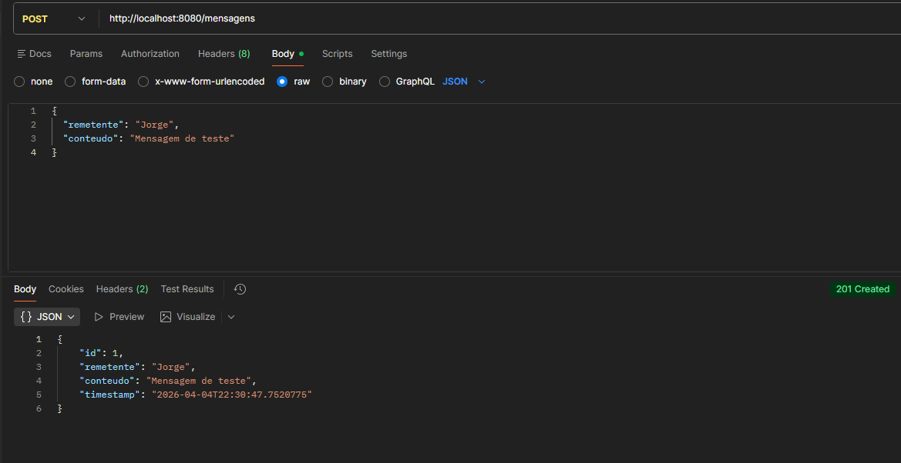
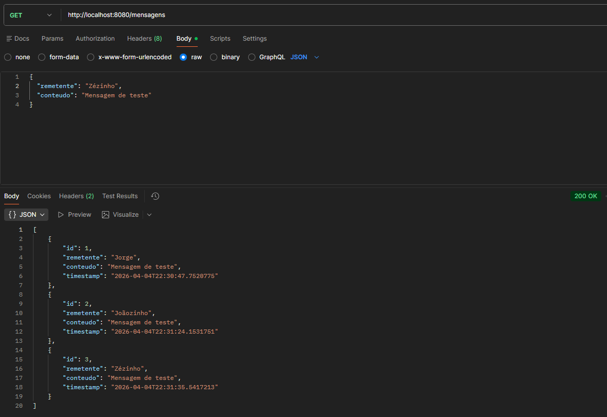
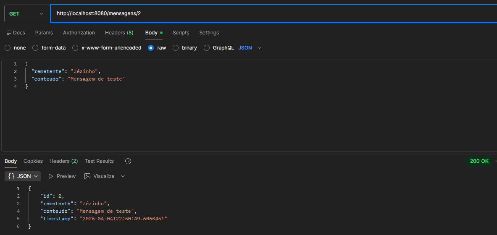
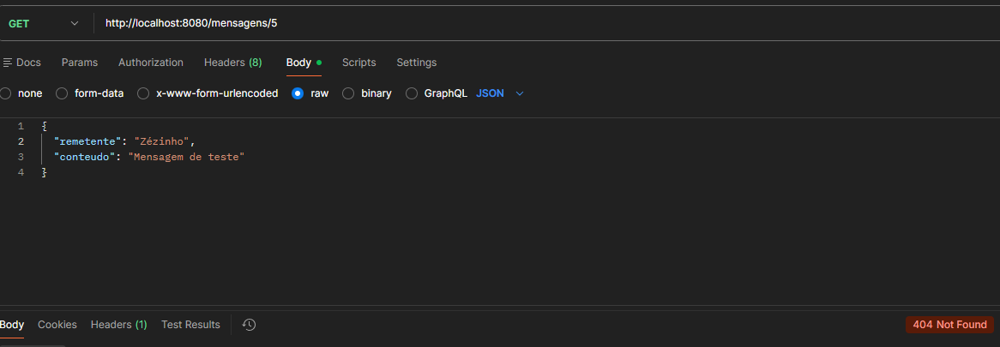
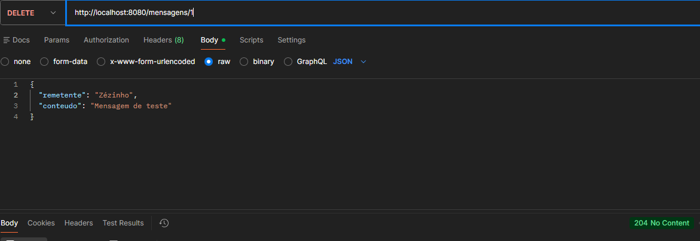

# Sistema de Mensageria Distribuída com Quarkus

## 1. Objetivo

Implementar uma aplicação distribuída simples utilizando o framework Quarkus, explorando o protocolo HTTP como mecanismo de comunicação direta entre processos, conforme o modelo de troca de mensagens (send/receive).

---

## 2. Arquitetura da Solução

A aplicação consiste em uma API REST que permite o envio, consulta e remoção de mensagens, simulando a comunicação entre processos distribuídos.

---

### Elementos do modelo distribuído

- **Sender (Remetente):** Cliente HTTP (Postman)
- **Receiver (Receptor):** API REST em Quarkus
- **Protocolo de comunicação:** HTTP (sobre TCP)
- **Formato da mensagem:** JSON

---

### Mapeamento Teórico (Send/Receive)

| Método HTTP | Operação | Descrição |
|------------|--------|----------|
| POST       | Send   | Envio de mensagem ao servidor |
| GET        | Receive| Recebimento de dados do servidor |
| DELETE     | Send   | Envio de requisição para remoção |

---

## 3. Evidências de Funcionamento

Os testes foram realizados utilizando o Postman.

### Tabela de Testes

| Endpoint | Método | Descrição | Status Esperado |
|----------|--------|----------|----------------|
| /mensagens | POST | Criar mensagem | 201 Created |
| /mensagens | GET | Listar mensagens | 200 OK |
| /mensagens/{id} | GET | Buscar por ID existente | 200 OK |
| /mensagens/{id} | GET | Buscar ID inexistente | 404 Not Found |
| /mensagens/{id} | DELETE | Remover mensagem | 204 No Content |

**Evidências:**

Criar mensagem - 201 Created

Listar mensagens - 200 OK

Buscar por ID existente - 200 OK

Buscar ID inexistente - 404 Not Found

Remover mensagem - 204 No Content

---

## 4. Status Codes Utilizados

- **200 OK**  
  Retornado quando a requisição é bem-sucedida (GET).

- **201 Created**  
  Indica criação de um novo recurso (POST).

- **404 Not Found**  
  Retornado quando o recurso não existe.

- **204 No Content**  
  Indica sucesso sem retorno de conteúdo (DELETE).

---

## 5. Tecnologias Utilizadas

- Java
- Quarkus
- RESTEasy (JAX-RS)
- Postman

---

## 6. Conclusão

A aplicação demonstra, de forma prática, o funcionamento da comunicação entre processos distribuídos utilizando HTTP. O modelo send/receive foi aplicado por meio dos métodos REST, evidenciando como requisições e respostas estruturam a troca de mensagens em sistemas distribuídos.

---
